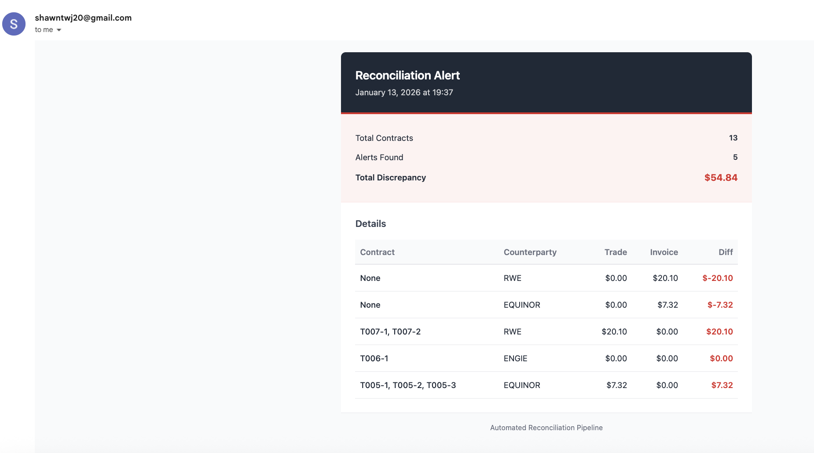

# Reconciliation

Trade reconciliation system with email alerting.

## Quick Start

1. **Setup environment**
   ```bash
   cp .env.example .env
   ```

2. **Configure SMTP email** (edit `.env`)
   ```
   EMAIL_ENABLED=true
   EMAIL_FROM=your-email@gmail.com
   EMAIL_TO=recipient@example.com
   SMTP_USER=your-email@gmail.com
   SMTP_PASSWORD=your-app-password
   ```

   **For Gmail:** [Get app password](https://support.google.com/a/answer/176600?hl=en)

   - Go to https://myaccount.google.com/security
   - Enable 2-Step Verification
   - Go to https://myaccount.google.com/apppasswords
   - Generate an App Password for "Mail"
   - Use that 16-character password as `SMTP_PASSWORD`

3. **Run**
   ```bash
   docker-compose up
   ```

## What It Does

- Ingests trade data from CSV files
- Runs reconciliation checks
- Sends email alerts when discrepancies exceed threshold



## Configuration

Key settings in [.env](.env):

- `ALERT_THRESHOLD`: Discrepancy threshold for alerts (default: 100.0)
- `EMAIL_ENABLED`: Enable/disable email alerts
- `INGEST_CHUNK_SIZE`: Batch size for data ingestion (default: 1000)
